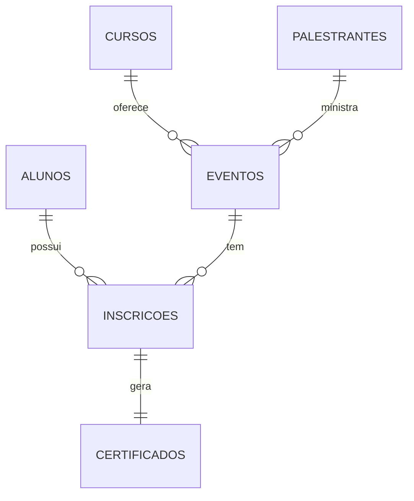

# αEventos - Hotsite Institucional

**Sistema de gerenciamento de eventos acadêmicos**  
_Plataforma para divulgação de eventos, inscrição de alunos e emissão de certificados_

---

## 🌟 Visão Geral

Projeto desenvolvido para o Hackathon UniALFA, com um sistema completo para:

- Divulgação categorizada de eventos
- Gestão de palestrantes e cursos
- Inscrição de participantes
- Emissão de certificados (futuro)

---

## 🚀 Funcionalidades

### ✅ Implementadas

- **Front-End Dinâmico** em PHP

  - Páginas por área acadêmica (Pedagogia, Sistemas, Direito)
  - Detalhes de eventos e palestrantes
  - Sistema de busca integrado

- **Banco de Dados Relacional**

  - Modelo normalizado com 6 tabelas interligadas
  - Dados de teste pré-cadastrados

- **Arquitetura Organizada**
  ```markdown
  hotsite-unialfa/
  ├── backend/
  │ ├── php-frontend/ # Front-End PHP
  │ │ ├── config/ # Arquivos de configuração
  │ │ ├── classes/ # Classes DAO e modelos
  │ │ ├── includes/ # Componentes reutilizáveis
  │ │ └── services/ # Lógica de negócio
  │ ├── node-api/ # Futura API REST
  │ └── java-backoffice/ # Serviços Java (futuro)
  ├── frontend/
  │ ├── assets/ # CSS, JS e imagens
  │ └── pages/ # Páginas públicas
  ├── banco-de-dados/ # Scripts SQL
  └── docs/ # Documentação técnica
  ```

---

## 🛠 Tecnologias

| Camada        | Tecnologias                         |
| ------------- | ----------------------------------- |
| **Front-End** | PHP 8.2, Bootstrap 5, FontAwesome 6 |
| **Back-End**  | Node.js (futuro), Java (futuro)     |
| **Banco**     | MySQL (XAMPP)                       |
| **Infra**     | Apache, .htaccess                   |

---

## 📊 Banco de Dados

**Nome:** `unialfa_eventos`

### Diagrama Entidade-Relacionamento:



### Tabelas Principais:

- `eventos`: Cadastro completo com links para cursos e palestrantes
- `inscricoes`: Registro de participação dos alunos
- `certificados`: Vinculados às inscrições (futuro)

---

## 🔧 Configuração

### Pré-requisitos

- XAMPP (Apache + MySQL + PHP)
- Node.js 18+ (para desenvolvimento futuro)

### Passo a Passo:

1. Clone o repositório
2. Importe o banco (`banco-de-dados/unialfa_eventos.sql`)
3. Configure o `constants.php`:
   ```php
   define('BASE_URL', 'http://localhost/hotsite-unialfa');
   ```
4. Acesse via:
   ```
   http://localhost/hotsite-unialfa
   ```

---

## 🧩 Equipe

| Nome                 | Função            |
| -------------------- | ----------------- |
| Daniel               | UX/UI & Front-End |
| Gaby e Alexandre     | API Node.js       |
| Jhonathan            | Banco de Dados    |
| Leonardo e Jhonathan | Serviços Java     |
| Daniel               | Documentação      |

---

## 📅 Roadmap

| Fase             | Status                |
| ---------------- | --------------------- |
| 1. Front-End PHP | 🚧 Em desenvolvimento |
| 2. API Node.js   | 🚧 Em desenvolvimento |
| 3. Back Office   | 🚧 Em desenvolvimento |

---

## 📜 Licença

Projeto acadêmico para fins educacionais.  
_Licenciado sob os termos da UniALFA._

---

🔗 **Acesso rápido:**

- [Documentação técnica completa](/docs/)
- [Modelo do banco](/banco-de-dados/ER_Diagrama.pdf)
- [Guia de estilos](/frontend/assets/css/STYLE_GUIDE.md)

_Atualizado em: 13/Junho/2025_

---

> "Organizar conhecimento é tão importante quanto produzi-lo" - _Equipe αEventos_
